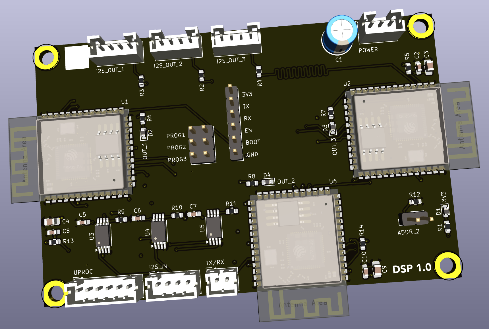

## Digital Signal Processing (DSP)

This board can process one stereo I2S audio stream in six independent DSP pipelines configurable over I2C. 

### Version History

- 1.0: Initial Release

### Speciality Components

* 3x ESP32-S3-WROOM-1-N16R8 microprocessors @ 240 MHz
* 3x PI6CV304 clock distributor
* TMP100 temperature sensor