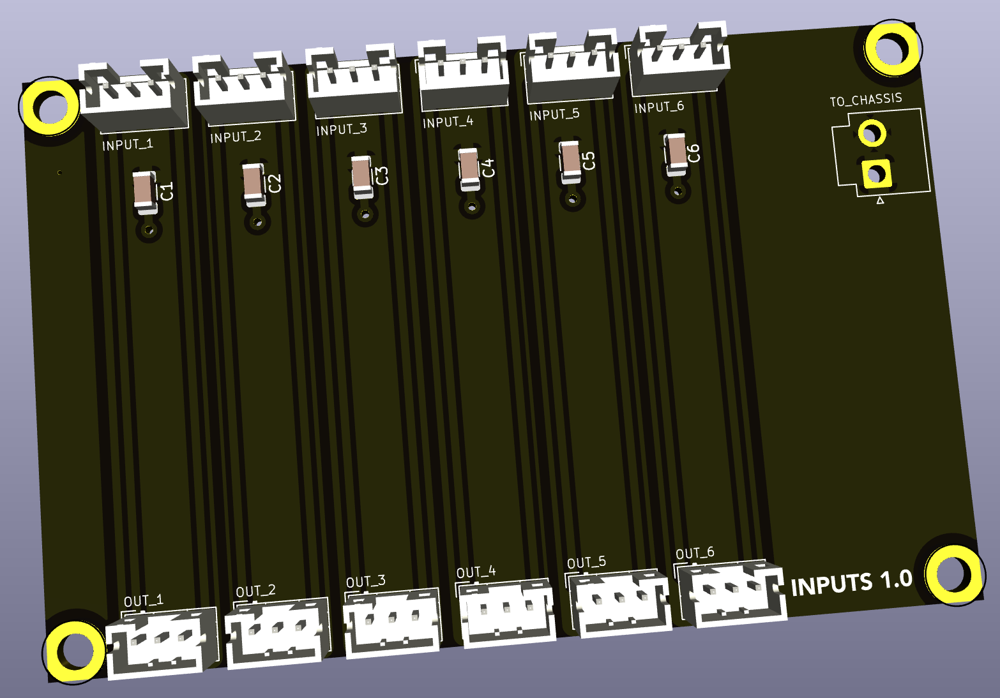

# Input board

This is a simple board meant to proxy six RCA input signals from one part of the amplifier to the other without long physical cable runs. It also provides a chassis GND connection via a capacitor to shunt stray EMI to chassis ground.

## Version History

- 1.0: Initial Release

## Speciality Components

