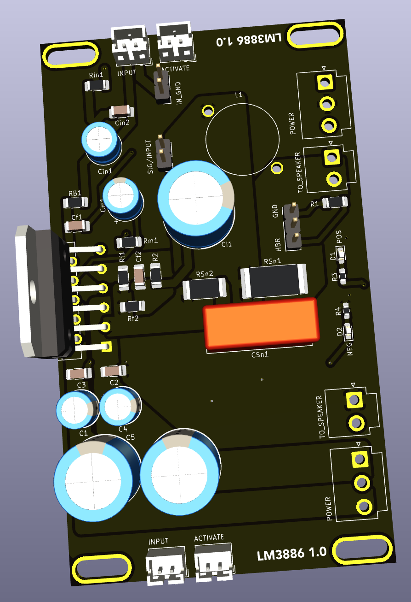

## LM3886

This board is meant to be reversable (top-to-bottom), and contains the highly rated, high fidelity LM3886 audio amplifier IC. Two of these boards are used in each monoblock to amplifier the associated tweeter and woofer channels.

### Version History

- 1.0: Initial Release

### Speciality Components

* LM3886 68W audio amplifier IC
* 500nH air core Inductor

