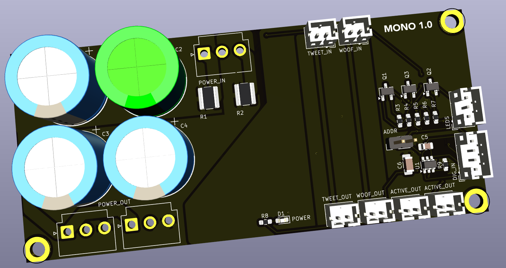

## Monoblocks

This board receives the main 7-pin XLR connections from the amplifier, which contain power, communincation, and control data.

### Version History

- 1.0: Initial Release

### Speciality Components

* TMP100 temperature sensor

