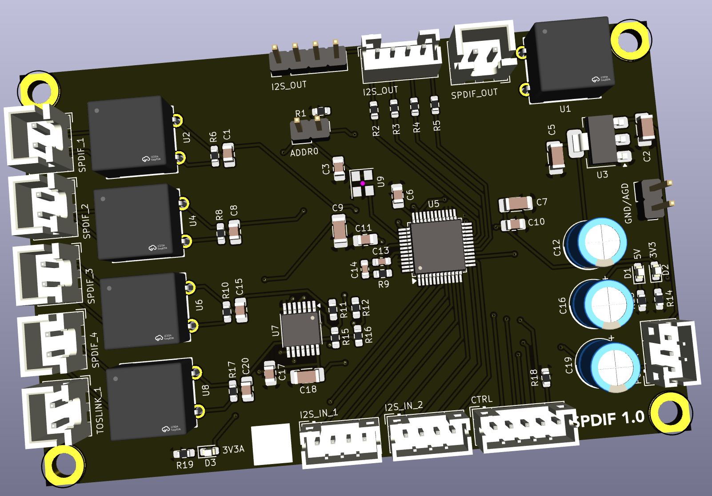

## SPDIF transceiver 

This board provides decoding for up to 5 SPDIF/TOSLINK digital audio connections.  It allows has two I2S inputs (one for the microprocessor, and one from the analog ADC board) which can be routed to the output.  It also has on digital SDPIF output for future use/expansion.

### Version History

- 1.0: Initial Release

### Speciality Compenents

* DIX9211 216-kHz Digital Audio Interface Transceiver