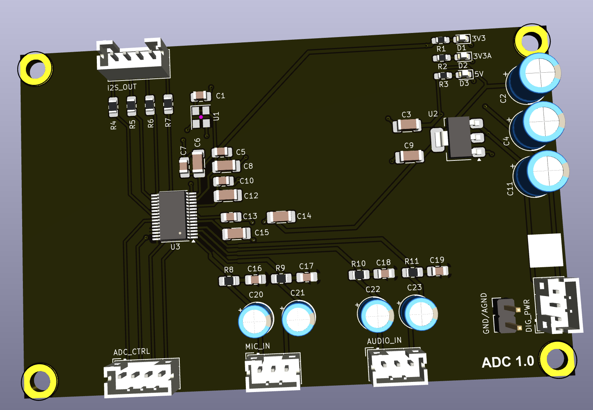

## Analog to Digital Converter (ADC)

This PCB allows takes a stereo line-level audio input and converts it to a digital I2S stream. The board also contains a microphone input for future expansion.

### Version History

- 1.0: Initial Release

### Speciality Components

* PCM1863 - 110dB 2-Channel Software-Controlled Audio ADC With Universal Front End 