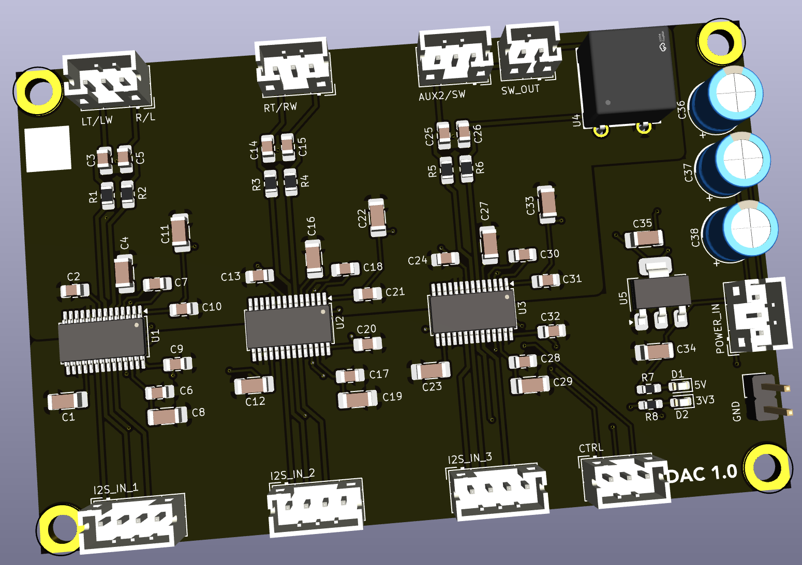

## DAC 

The board processes three stereo digital I2S channels (representing left woofer / left tweeter, right woofer / right tweeter, and a subwoofer channel) from the digital signal processing board and converts it to analog for the monoblocks.

### Version History

- 1.0: Initial Release

### Speciality Components

- 3x PCM5122 - 2V RMS DIRECTPATH 112dB Audio Stereo DAC with PCM Interface and Fixed Audio Processing
