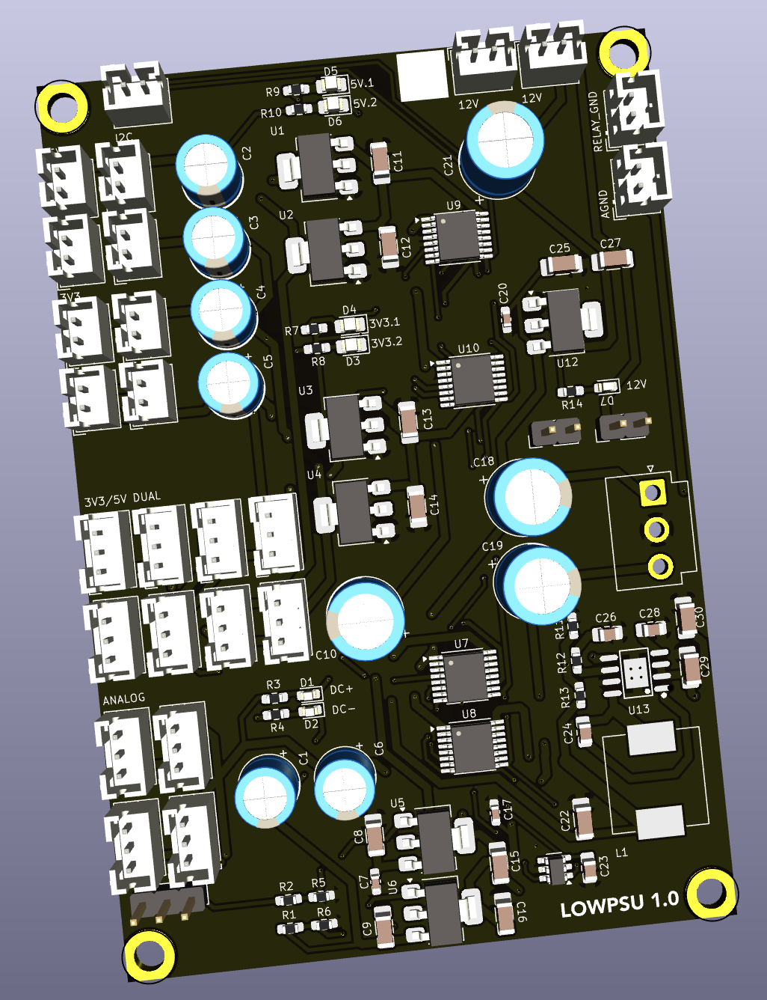

## Low-Voltage Power Supply

This board produces several low-voltage power supplies for use in the amplifier: +/- 9.5V for analog operational amplifiers, 3.3V and 5V for digital logic, and 12V for relays.

### Version History

- 1.0: Initial Release

### Speciality Components

* LM317 & LM337 variable voltage regulators
* AP64351SP-13 switched voltage regulator
* Various AMS1117 linear regulators (3.3V, 5V, 12V)
* 4x INA260 current monitors
