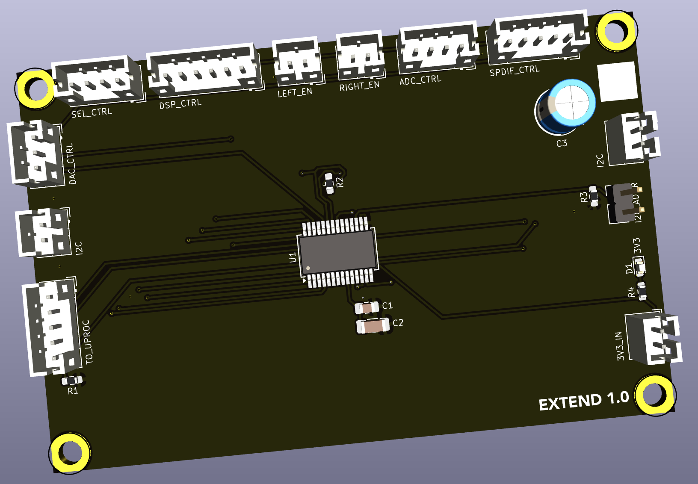

## GPIO Extension 

This board provides additional GPIO pins for use within the amplifier. It provides the main control connections to the various boards.

### Version History

- 1.0: Initial Release

### Speciality Components

* MCP23017 GPIO extender

