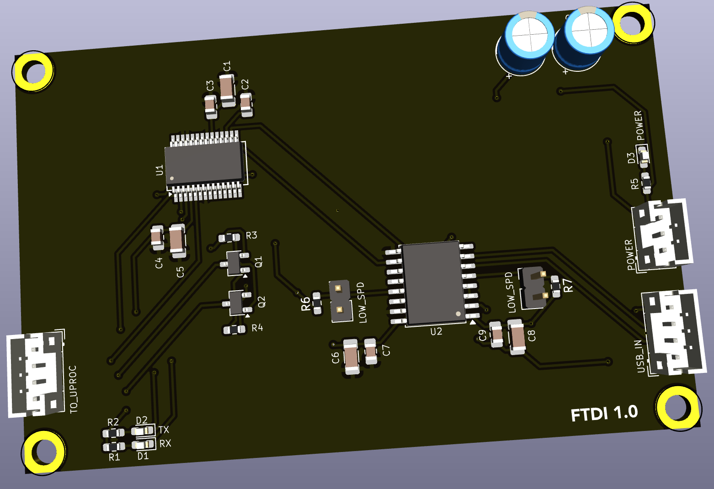

## FTDI communcations board

This board converts a USB connection into a UART compatible one for use in programming and debugging the main ESP32 microprocessor board.  It has a 4-pin USB
connector to go to the chassis to connect an external USB cord.

### Version History

- 1.0: Initial Release

### Speciality Components

* FT232RL USB to UART
* ADUM3160 USB isolator

